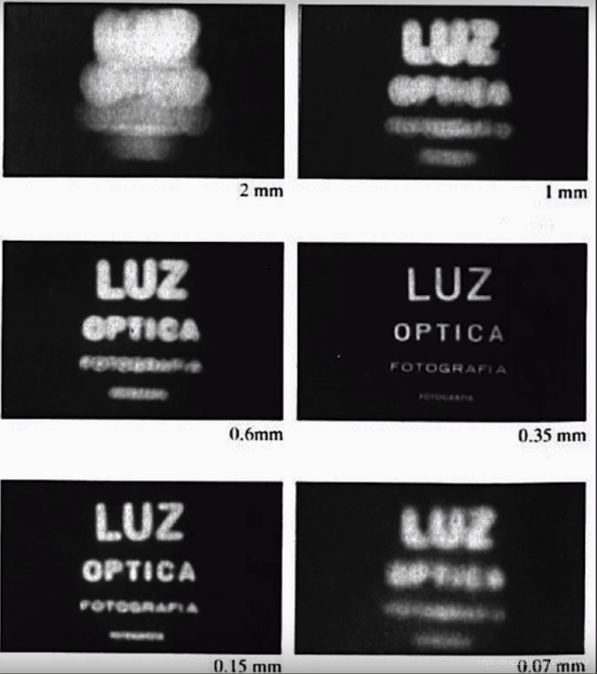
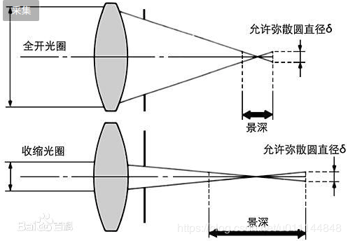
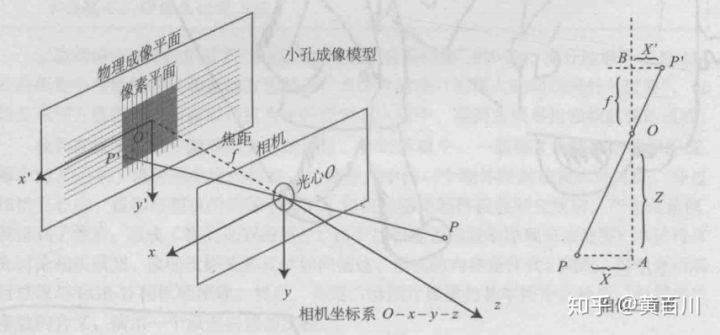
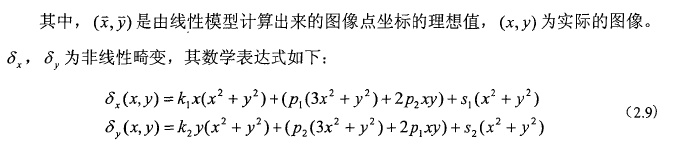
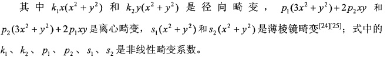
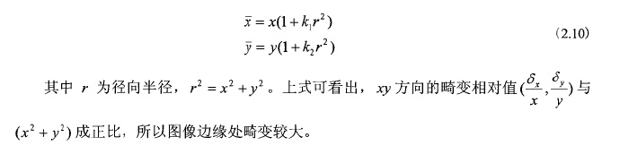
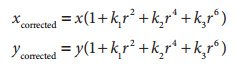
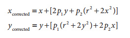

[TOC]

## 基本概念

&nbsp;&nbsp;&nbsp;&nbsp;&nbsp;&nbsp;👉🏻**aperture(光圈)**：用来控制光线透过镜头的的装置，小孔成像模型中的孔径，光圈越大进光面积就会越大。

&nbsp;&nbsp;&nbsp;&nbsp;&nbsp;&nbsp;👉🏻**depth of field(景深)**：就是聚焦清晰的焦点前后“可接受的清晰区域”

&nbsp;&nbsp;&nbsp;&nbsp;&nbsp;&nbsp;注：光圈越小，景深越大，光圈越大，景深越短，但光圈太小会产生衍射现象，如下图，第一张模糊是光圈太大，导致景深不够而模糊，最后一张是衍射现象

&nbsp;&nbsp;&nbsp;&nbsp;&nbsp;&nbsp;光圈和景深的关系(截取自百度百科)

&nbsp;&nbsp;&nbsp;&nbsp;&nbsp;&nbsp;👉🏻**field of view(视野)**：镜头中心点到[成像](https://baike.baidu.com/item/成像)平面[对角线](https://baike.baidu.com/item/对角线)两端所形成的[夹角](https://baike.baidu.com/item/夹角)就是镜头视角，对于相同的成像面积，[镜头焦距](https://baike.baidu.com/item/镜头焦距)越短，其视角就越大。

&nbsp;&nbsp;&nbsp;&nbsp;&nbsp;&nbsp;&nbsp;&nbsp;&nbsp;&nbsp;当焦距变短时，视角就变大了，可以拍出更宽的范围，但这样会影响较远拍摄对象的[清晰度](https://baike.baidu.com/item/清晰度)。

&nbsp;&nbsp;&nbsp;&nbsp;&nbsp;&nbsp;&nbsp;&nbsp;&nbsp;&nbsp;当焦距变长时，视角就变小了，可以使较远的物体变得清晰，但是能够拍摄的宽度范围就变窄了。

​																				θ=arctan(d/(2*f))

&nbsp;&nbsp;&nbsp;&nbsp;&nbsp;&nbsp;&nbsp;&nbsp;&nbsp;&nbsp;视野取决与两个因素：成像平面(sensor)的大小、焦距。焦距越大视野越小。

&nbsp;&nbsp;&nbsp;&nbsp;&nbsp;&nbsp;&nbsp;&nbsp;&nbsp;&nbsp;👉🏻**iso(感光度)**：指感光材料（胶片或数码相机的传感器CCD/CMOS）对光照的敏感程度。感光度ISO大致分为：25、50、100、200、400、800、1600、3200、6400、12800。数值越小，感光度越低；数值越大，感光度越高。

## 针孔相机模型 - 近似线性模型

#### 坐标系描述

#### 成像过程

&nbsp;&nbsp;&nbsp;&nbsp;&nbsp;&nbsp;世界坐标系—>相机坐标系—>图像坐标系—>像素坐标系

###### 1、世界坐标系->相机坐标系

###### 2、相机坐标系–>象平面坐标系

###### 3、象平面坐标系–>像素平面坐标系

###### 4、世界坐标到像素坐标

## 非线性模型

&nbsp;&nbsp;&nbsp;&nbsp;在实际的成像过程中，考虑镜头的失真，一般都存在非线性畸变，所以线性模型不能准确描述成像几何关系

&nbsp;&nbsp;&nbsp;&nbsp;引起畸变的两个主要因素：
&nbsp;&nbsp;&nbsp;&nbsp;&nbsp;&nbsp;&nbsp;&nbsp;&nbsp;&nbsp;**1、透镜形状：径向畸变** -- 制作一个”球形“透镜比制作一个数学上理想的透镜更容易
&nbsp;&nbsp;&nbsp;&nbsp;&nbsp;&nbsp;&nbsp;&nbsp;&nbsp;&nbsp;**2、透镜与成像平面不平行：切向畸变**   -- 从机械方面讲，也很难把透镜和成像仪保持平衡

&nbsp;&nbsp;&nbsp;&nbsp;非线性畸变理论可用下列公式描述：

&nbsp;&nbsp;&nbsp;&nbsp;&nbsp;&nbsp;若考虑非线性畸变，则对相机标定时需要使用非线性优化算法。而有研究表明引入过多的非线性参入（如离心畸变和薄棱畸变）不仅不能提高精度，还会引起解的不稳定。一般情况下径向畸变就足以描述非线性畸变，所有本课题只是考虑径向畸变。则将式(2.9)中的径向畸变代入式(2.8)可得：

&nbsp;&nbsp;&nbsp;&nbsp;&nbsp;&nbsp;实际应用

&nbsp;&nbsp;&nbsp;&nbsp;&nbsp;&nbsp;&nbsp;&nbsp;&nbsp;&nbsp;&nbsp;1、径向畸变

&nbsp;&nbsp;&nbsp;&nbsp;&nbsp;&nbsp;&nbsp;&nbsp;&nbsp;对径向畸变，成像仪中心（光学中心）是畸变为0，随着向边缘移动，畸变越来越严重。故我们可以用在r=0处的泰勒级数展开的前几项来定量描述。

&nbsp;&nbsp;&nbsp;&nbsp;&nbsp;&nbsp;&nbsp;&nbsp;&nbsp;对于便宜的网络摄像机，我们通常使用前两项，其中通常第一项为k1,而第二项为k2。对畸变很大的摄像机，比如鱼眼透镜，我们使用第三个径向畸变项k3。通常成像仪某点的径向位置按下式调节：

​																					

&nbsp;&nbsp;&nbsp;&nbsp;&nbsp;&nbsp;&nbsp;&nbsp;&nbsp;&nbsp;这里(x,y)是畸变点在成像仪上的原始位置，(xcorrected,ycorrected)表示矫正后的新位置。

&nbsp;&nbsp;&nbsp;&nbsp;&nbsp;&nbsp;&nbsp;&nbsp;&nbsp;2、切向畸变

&nbsp;&nbsp;&nbsp;&nbsp;&nbsp;&nbsp;&nbsp;&nbsp;&nbsp;切向畸变是由于透镜制造上的缺陷使得透镜本身与图像平面不平行而产生的。径向畸变可以有两个额外的参数p1和p2来描述，如下：

&nbsp;&nbsp;&nbsp;&nbsp;&nbsp;&nbsp;&nbsp;&nbsp;&nbsp;因此总共有5个我们需要的畸变参数。

## 参考资料

[相机模型(一)](https://blog.csdn.net/u011144848/article/details/90605108)

[摄像机模型与标定——相机模型](http://blog.sina.com.cn/s/blog_77dd9d490102viun.html)

[视觉SLAM14讲——相机模型介绍](https://zhuanlan.zhihu.com/p/41023782)

